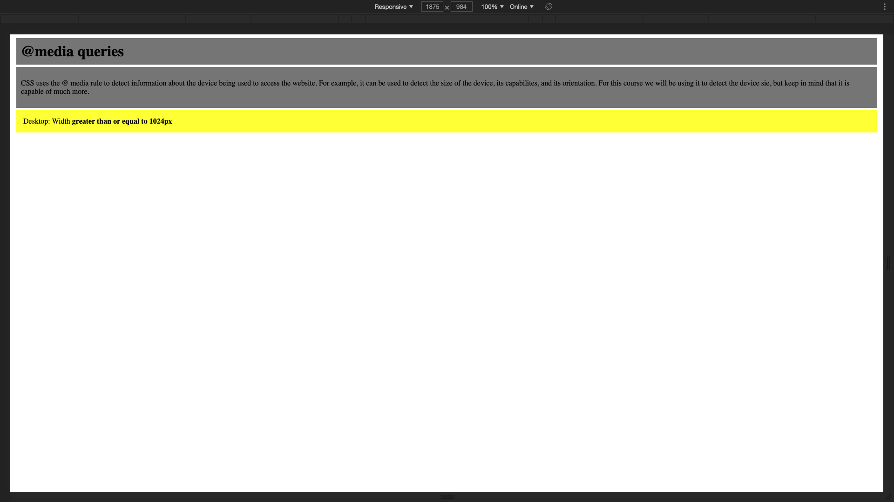
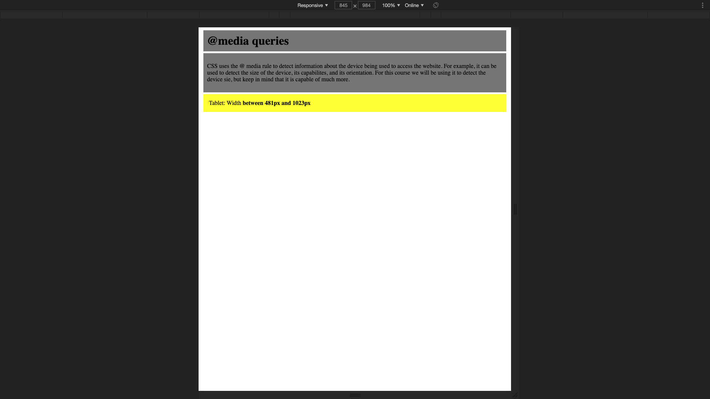
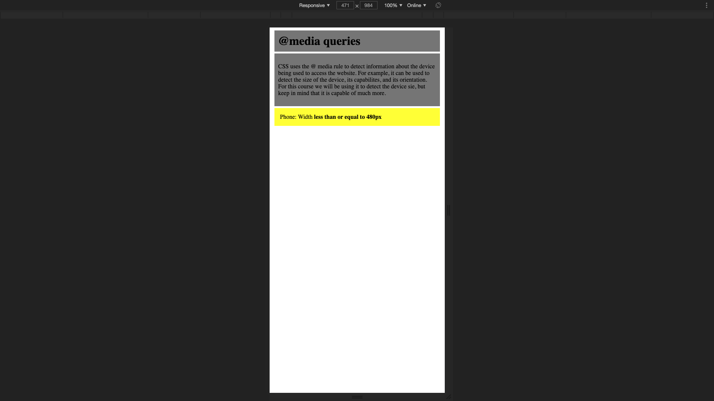

# ResponsiveText
  A page I created while learning to code at the Coding Dojo. This page uses media queries to change the text as the window size is resized.
  
# What I learned
  * Make text responsive with media queries
  
# Screenshots

